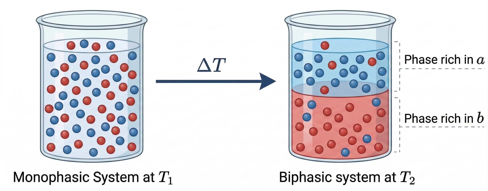
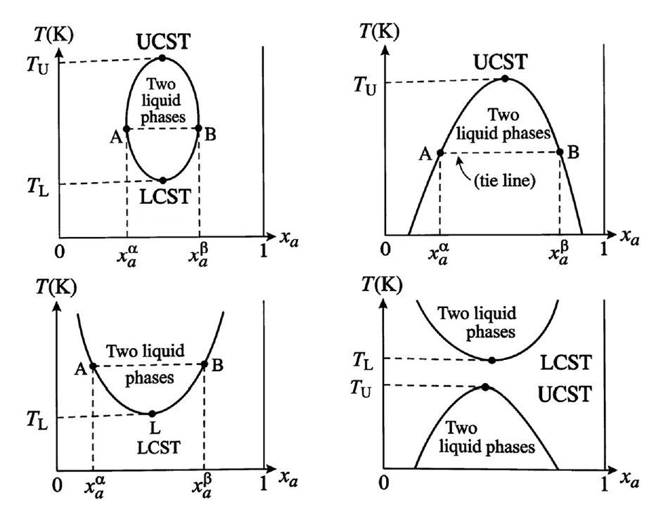
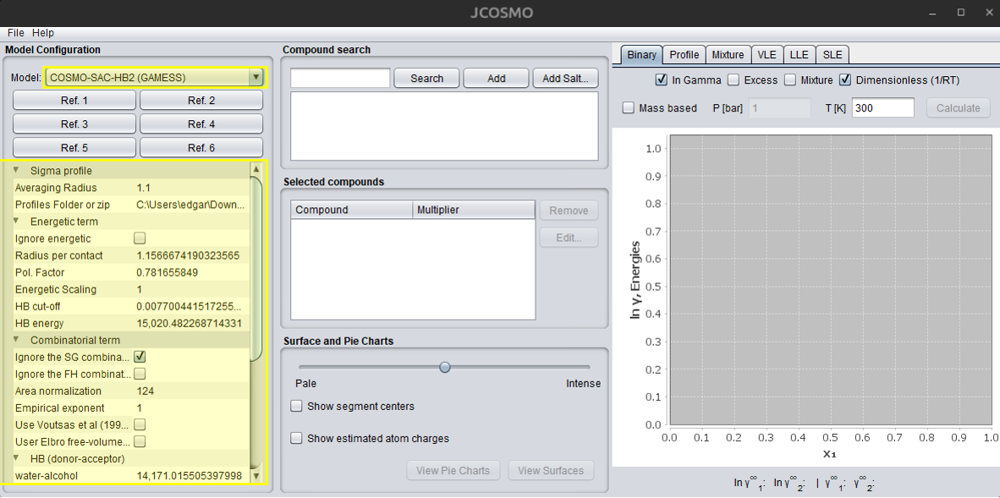
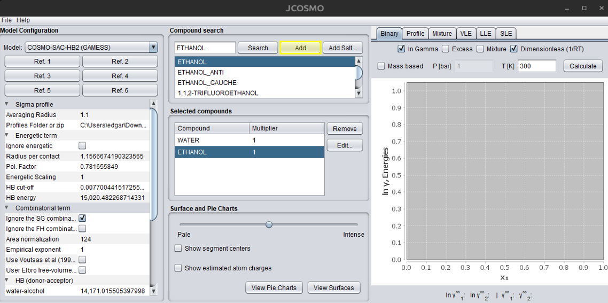
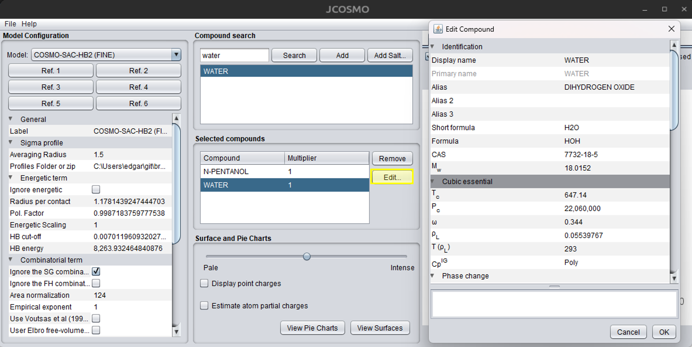
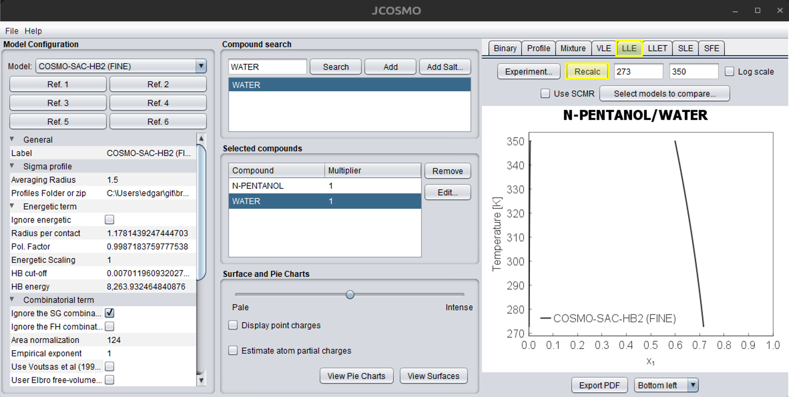
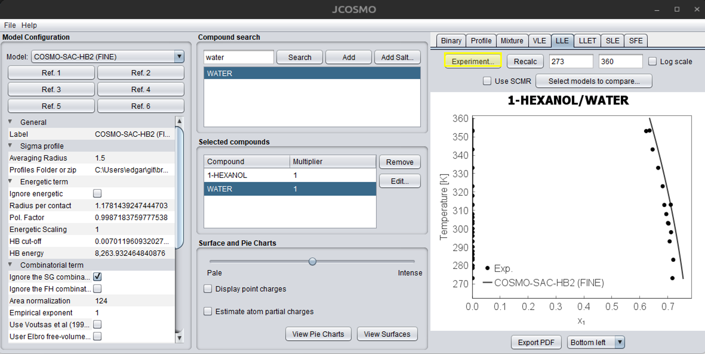
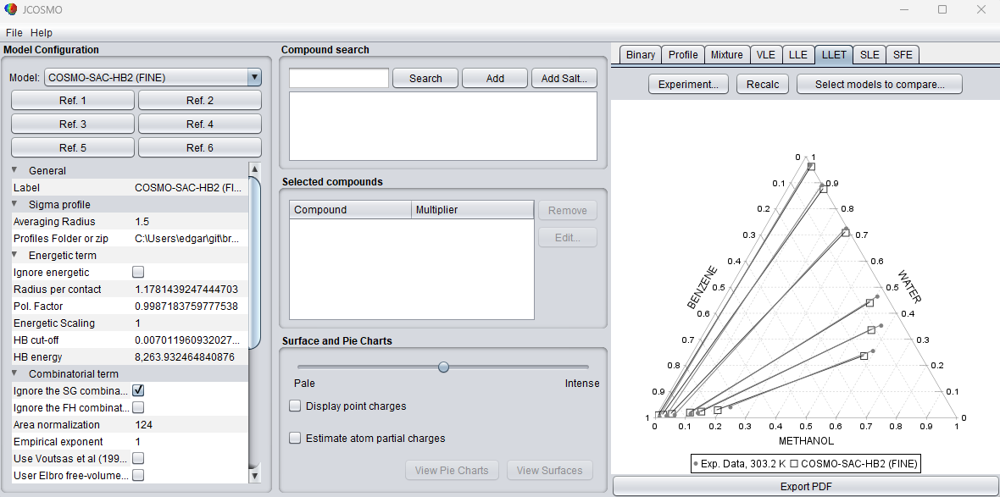

# Liquid–Liquid Equilibrium (LLE)
This section is largely based on the work of Koretsky (2012)[@Koretsky2012] and Smith et al. (2007)[@Smith2007], which constitute the primary theoretical basis for the LLE description presented here. Additional references are cited when relevant to specific aspects or extensions of their approach.

## Theory Concepts
Liquid–Liquid Equilibrium (LLE) refers to the thermodynamic condition in which two or more liquid phases coexist at equilibrium. This phenomenon occurs in mixtures composed of partially miscible components, where interactions between unlike molecules are weaker than those between like molecules. Under such conditions, a homogeneous liquid mixture may become unstable and split into two distinct liquid phases with different compositions. Understanding LLE is essential for the design and optimization of liquid–liquid extraction processes that employ selective solvents to separate chemical species.

Phase separation into two liquid phases occurs when the total Gibbs free energy of the system decreases by forming phases of different compositions rather than remaining as a single homogeneous mixture. When this occurs, each phase becomes enriched in one or more components of the mixture. For convenience, the two liquid phases are typically denoted as phase \(\alpha\) and phase \(\beta\), each having its own equilibrium composition.

<figure style="text-align: center;">
  
  <figcaption>Illustration of LLE formation with temperature variation.</figcaption>
</figure>

The thermodynamic condition for equilibrium between phases requires that the fugacity of each component be equal in all phases. For a component \(i\) distributed between two liquid phases \(\alpha\) and \(\beta\), the equilibrium condition can be expressed as:

$$
\hat{f}_i^{\alpha} = \hat{f}_i^{\beta}
$$

where \(\hat{f}_i^{\alpha}\) and \(\hat{f}_i^{\beta}\) represent the fugacity of component \(i\) in phases \(\alpha\) and \(\beta\), respectively. In many practical LLE applications, pressures are relatively low to moderate, allowing the use of the Lewis–Randall reference state. Under this assumption, the fugacity of a component in a liquid mixture can be expressed in terms of activity coefficients, leading to the relation:

$$
x_i^{\alpha}\gamma_i^{\alpha} f_i^{\circ}
=
x_i^{\beta}\gamma_i^{\beta} f_i^{\circ}
$$

where \(x_i\) denotes the mole fraction of component \(i\), \(\gamma_i\) is the activity coefficient of component \(i\), and \(f_i^{\circ}\) is the fugacity of the pure component at the system temperature and pressure. Because temperature and pressure are identical in both phases, the pure-component fugacity cancels out, resulting in the commonly used equilibrium expression:

$$
x_i^{\alpha}\gamma_i^{\alpha}
=
x_i^{\beta}\gamma_i^{\beta}
$$

For a binary mixture composed of components \(a\) and \(b\), this condition generates a system of equations that determines the equilibrium compositions of the two phases, together with the constraint that the mole fractions in each phase must sum to unity.

Accurate calculation of LLE requires reliable models to represent the activity coefficients of the mixture. Since partially miscible liquid systems typically exhibit strong deviations from ideality, empirical or semi-empirical excess Gibbs energy models are commonly employed. Among the most widely used models are the Non-Random Two-Liquid (NRTL) model [@Renon1968], the UNIQUAC model [@Abrams1975], the UNIFAC model [@Fredenslund1975], and the COSMO-SAC model [@Lin2002]. The parameters of these models are usually obtained by fitting experimental liquid–liquid equilibrium data, enabling the prediction of phase compositions over a range of temperatures and compositions. An exception is the COSMO-SAC model, which uses only universal parameters, often estimated from IDAC data [@Ferrarini2018]. For more information about activity-coefficient models, see the Theory section of this documentation.

In systems where liquid–liquid equilibrium occurs at elevated pressures, the activity-coefficient formulation is no longer sufficient to accurately describe phase behavior. In such cases, the equilibrium condition is expressed using fugacity coefficients derived from equations of state. The formulation can be written in a form analogous to the previous equations, where activity coefficients are replaced by fugacity coefficients:

$$
\phi_i^{\alpha} x_i^{\alpha}
=
\phi_i^{\beta} x_i^{\beta}
$$

where \(\phi_i\) denotes the fugacity coefficient of component \(i\). Fugacity coefficients are typically calculated using cubic equations of state such as the Peng–Robinson [@Peng1976], Redlich–Kwong [@Redlich1949], Soave–Redlich–Kwong [@Soave1972], or the COSMO-SAC-Phi equation of state [@Soares2019CSP]. In many practical applications, equations of state are combined with activity models to describe highly non-ideal liquid mixtures. This combination is commonly implemented through mixing rules that relate the excess Gibbs energy to equation-of-state parameters, with the Huron–Vidal mixing rule [@Huron1979] being a frequently used example. The Theory section of this documentation provides more detailed information about equations of state and mixing rules.

The results of LLE calculations are often represented using temperature–composition diagrams at constant pressure. These diagrams, commonly referred to as liquid–liquid solubility diagrams, illustrate the regions of single-phase and two-phase behavior for a given binary system. The boundary separating the single-phase and two-phase regions is known as the binodal curve. Within the two-phase region, pairs of compositions that coexist at equilibrium are connected by tie lines. These diagrams may exhibit characteristic critical temperatures known as the upper critical solution temperature (UCST) and the lower critical solution temperature (LCST). Above the UCST or below the LCST, the mixture becomes completely miscible in all proportions. Different binary mixtures may exhibit distinct diagram topologies, including closed miscibility gaps or systems possessing only one of these critical temperatures. The figure below shows examples of diagram types that can be obtained.

<figure style="text-align: center;">
  
  <figcaption>Four diagram types of liquid–liquid solubility at constant pressure.</figcaption>
</figure>

The stability of a homogeneous liquid mixture can also be analyzed through the curvature of the Gibbs free energy of mixing. A single liquid phase becomes unstable when the second derivative of the molar Gibbs free energy with respect to composition is negative at constant temperature and pressure. Mathematically, this condition can be written as:

$$
\left(\frac{\partial^2 g}{\partial x^2}\right)_{T,P} < 0
$$

The molar Gibbs free energy of a mixture can be expressed as the sum of an ideal contribution and an excess Gibbs energy term:

$$
g = \sum x_i g_i + RT \sum x_i \ln x_i + g^{E}
$$

where \(g^{E}\) represents the excess Gibbs free energy of the mixture. The region defined by the instability condition corresponds to the spinodal region of the phase diagram. Between the binodal and spinodal curves lies a metastable region in which the mixture can remain as a single phase but may separate into two phases upon sufficient perturbation.

In summary, liquid–liquid equilibrium describes the coexistence of multiple liquid phases in partially miscible systems and plays a fundamental role in many separation processes. The thermodynamic description of this phenomenon is based on the equality of component fugacities between phases and is typically implemented through activity-coefficient models or equations of state, depending on the pressure conditions. These theoretical concepts form the basis for the computational modeling of LLE and for predicting the compositions of coexisting liquid phases in multicomponent mixtures.
## Algorithm
This section is currently under development and will be available soon. Stay tuned for updates!
## Practical Example
The main model should be selected in the dropdown list shown in the figure below. The model's default options are displayed under the references links, with values of the universal parameters and different options of combinatorial terms.
<p align="center">
  
</p>

JCOSMO currently supports binary and ternary LLE systems. However, the Mixture tab allows users to view activity coefficients for mixtures with n compounds. This data can be extracted via a Python script, and phase equilibria can then be solved externally. Further details are described in the Python Interface section.

For a binary system, you can directly search for the two compounds and add them to the system, as illustrated in the figure below. The search engine uses compound names; if the desired compound is not found, try using alternative synonyms. The first selected compound is represented by the subscript **1**, and the second by **2** in all calculated properties.
<p align="center">
  
</p>

Before starting the LLE calculations, press the "Edit..." button and carefully review the properties of each compound.  If critical properties are missing, they should be added if a cubic equation of state is going to be used. After making the necessary changes, confirm by clicking the "OK" button. The figure below illustrates the process of editing compounds and their properties:
<p align="center">
  
</p>

The next step is to compute the LLE. First, select the LLE tab in the upper-right corner of the JCOSMO window. The field on the right corresponds to the temperature range, and can be adjusted by the user. The temperature must be provided in Kelvin. When the cursor is placed over any of these fields, a tooltip will appear indicating the required property and its unit. The "Use SCMR" option enables the user to apply this mixing rule, which combines an activity coefficient model with an equation of state. Currently, only the SRK-MC equation of state is available for this option. For more information, refer to the "Cubic Equations and Mixing Rules" section under the Theory tab. The next dropdown menus are used to select more models to compare with the main model. Ensure that all required properties are included for each model. Finally, press the "Recalc" button to compute the LLE. The figure below illustrates this process in the JCOSMO GUI. If you want to save the chart you can press the "Export to PDF" button, which will save a PDF file in the ...\jcosmo3\pdf directory.  Alternatively, you can right click with the mouse and copy the chart. The "Copy to clipboard" option will save the calculations, which can be pasted in an Excel file. The caption box location can be changed in the dropdown menu at the bottom of the window. For more details about binary charts and all options, see the "Binary Mixture Charts" section under Use cases in this documentation.
<p align="center">
  
</p>

The comparison of experimental data with the calculated results is also available. This requires creating a .txt file following the template shown below. The hash symbol (#) is used for comments. Initially write the first and second components, from left to right, with the exact same name as found in the interface. If underscores (_) are used in the compound names, they will automatically be converted to spaces when the data are read. Then, add a header with temperature (T), pressure (P), molar composition of the first component in the \(\alpha\) phase (X1_ALPHA), and molar composition of the second component in the \(\beta\) phase (X2_BETA). The composition of component 2 in the \(\beta\) phase is optional. If it is not provided, the missing values will automatically be assigned as -1. Mass fractions are also supported; simply replace the letter X with W.  Right after the property, include its respective unit. Other temperature units can be used, but never use the degree symbol (°) or it will cause errors. Same for pressure, several units can be used – atm, mmHg, bar, psi, BTU. If data for one of the phases is missing, entering -1 will indicate its absence. To simplify data input, the suffix (_100) can also be used, indicating that the composition values are multiplied by 100, which avoids the unnecessary repetition of trailing zeros.

```
# Maczynski et al.- UPAC-NIST Solubility Data Series. 81... Part 3
#
#
1-HEXENE WATER
T K	P kPa	X1_ALPHA	W2_BETA
293.2	101.3	0.0000100	0.0016
298.2	101.3	0.0000118	-1
303.2	101.3	-1		    0.00223
310.9	206.8	0.0000120	-1
366.5	318.4	0.0000240	0.01015
420.4	1247.3	-1		    0.04329
422.0	101.3	0.0000850	-1
477.6	101.3	0.0004400	-1
494.3	101.3	0.0007300	-1
```

```
# Stephenson - Mutual Solubilities: Water-Ketones, Water-Ethers, and Water-Gasoline-Alcohols
#
DIETHYL_KETONE WATER
T C	P kPa	W1_ALPHA_100	W2_BETA
0	 101.3	7.68	1.57
9.7	 101.3	6.25	1.77
19.3 101.3	5.3	    2
30.6 101.3	4.24	2.51
40.3 101.3	3.86	2.49
50	 101.3	3.62	2.81
60.1 101.3	3.43	2.98
70.1 101.3	3.3	    2.99
80.2 101.3	3.16	3.69
```

After building the .txt file, you can simply load it into the program by clicking the "Experiment..." button on the LLE tab, as shown below:

<p align="center">
  
</p>

The ternary option is currently only available using the "Experiment..." option. The `.txt` file must follow a specific structure so that the program can correctly read the experimental data. The head must contain the names of the three components, written from left to right. The names must match exactly those used in the interface database. After the component names, a header line must be provided containing the thermodynamic variables and compositions in the following order: T [temperature_unit]  P [temperature_unit]  X1  X2  Y1  Y2. In this header, T represents the temperature followed by its unit and P represents the pressure followed by its unit, similar to the binary systems examples. X1 and X2 correspond to the compositions of components 1 and 2 in the \(\alpha\) phase, respectively, while Y1 and Y2 correspond to the compositions of components 1 and 2 in the \(\beta\) phase. The composition of the third component is not explicitly included in the file and is automatically calculated as 1 − x1 − x2 and 1 − y1 − y2. Mass fractions may also be used instead of mole fractions. In this case, replace X1 and X2 with W1 and W2, and replace Y1 and Y2 with WY1 and WY2. When these labels are used, the compositions are interpreted as mass fractions. Examples of valid ternary experimental data files are shown below:
```
# Letcher, T. M.; Bricknell, B. C.; Sewry, J. D.; Radloff, S. E.
# Liquid-Liquid Equilibria for Mixtures of an Alkanol + Hept-1-ene + Water at 25 .degree.C
# J. Chem. Eng. Data, 1994, 39, 320-323
2-PROPANOL 1-HEPTENE WATER
T K P kPa X1 X2 Y1 Y2
298	101.3	0.197	0.009	0.19	0.764
298	101.3	0.300	0.032	0.291	0.616
298	101.3	0.382	0.092	0.342	0.518
298	101.3	0.412	0.185	0.372	0.45
```

```
#  S. MohammadReza Seyedein Ghannad, Mohammad Nader Lotfollah, Ali Haghighi Asl, DOI: 10.1016/j.jct.2011.01.011
N-FORMYLMORPHOLINE BENZENE CYCLOHEXANE
T K P atm W1 W2 WY1 WY2
313.15	1	0.1561	0.0644	0.9321	0.0404
313.15	1	0.1897	0.1202	0.8845	0.0783
313.15	1	0.2773	0.1906	0.8276	0.1251
313.15	1	0.3266	0.2558	0.7768	0.1701
313.15	1	0.3451	0.2983	0.7208	0.2131
313.15	1	0.3809	0.3177	0.6888	0.2411
```
The following figure shows an example of a ternary plot obtained from the first .txt example. The chart can be used in the same way as the binary chart described earlier.

<p align="center">
  
</p>
