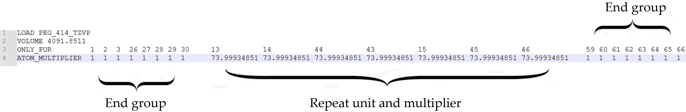

# Extending \(\sigma\)-profiles for polymers
Modeling polymers using COSMO-based methods requires special treatment due to their large molecular size and repetitive structural units. Performing full quantum chemical calculations for entire polymer chains is computationally prohibitive. Extending \(\sigma\)-profiles for polymers provides an efficient alternative, enabling the construction of representative COSMO surfaces for macromolecules from monomer-level information. This approach significantly reduces computational cost while preserving a physically meaningful description of the polymer’s surface polarity and volume. The resulting polymer \(\sigma\)-profile can be directly used in COSMO-SAC calculations, allowing the phase equilibrium prediction without the need for full polymer-level quantum computations.

## Creating .custom files
This section describes the procedure used to construct the .custom file, necessary for extending the polymer \(\sigma\)-profile. The .custom file can be opened and inspected with any text editor. An example is presented in the figure below:

<figure style="text-align: center;">
  
  <figcaption>Example of the .custom file for polyethylene glycol (PEG) with a molar mass of 3350 g/mol.</figcaption>
</figure>

**1. Loading the COSMO File**

The construction procedure begins by loading the .cosmo file of the monomer using the LOAD command, as illustrated in Figure 1. This file must contain the COSMO surface information generated from a quantum chemical calculation.

**2. Estimation of the Monomer Volume**

The molecular volume of the monomer is estimated from the difference in total COSMO volumes between oligomers of different chain lengths. This value, given in \(\text{Å}^3\), is used in the construction of the polymer model and must be specified in the .custom file, as shown in Figure 1. The surface area is automatically computed by JCOSMO using the multiplier and the monomer .cosmo file.

**3. Defining the COSMO Surface Atoms**

The ONLY_FOR command specifies which atoms of the monomer contribute to the COSMO surface. Atom indices can be identified directly from the .cosmo file or through JCOSMO by selecting “View Surfaces” and hovering the cursor over the atoms of interest.

**4. Assigning Atom Multipliers**

The ATOM_MULTIPLIER command is used to assign multiplicative factors to the atoms of the COSMO surface:

- Atoms belonging to the terminal groups receive a multiplier of 1.

- Atoms belonging to the repeating unit receive a multiplier corresponding to the number of monomeric units required to reach the target polymer molar mass. 

This procedure ensures that the final COSMO surface represents a polymer with the target molar mass while preserving the correct relative contributions of the end groups and repeating units. The calculation of the appropriate multiplier \((N_b)\) is described by Equation 1, where \(MW_e\) is the molecular weight of an end group, \(MW_r\) is the molecular weight of the repeating unit, and \(MW_p\) is the average molecular weight of the polymer.

$$N_b=\frac{M W_p-\sum M W_e}{M W_r} \tag{1}$$

**5. Final .custom File**

Once all commands and multipliers have been correctly defined, the .custom file can be saved. This file contains all structural and surface specifications required for COSMO-based thermodynamic calculations of the polymer, as it automatically retrieves the necessary information from the monomer .cosmo file. Both files, the .custom and the corresponding monomer.cosmo must be located in the Profile Folder referenced in JCOSMO GUI.

