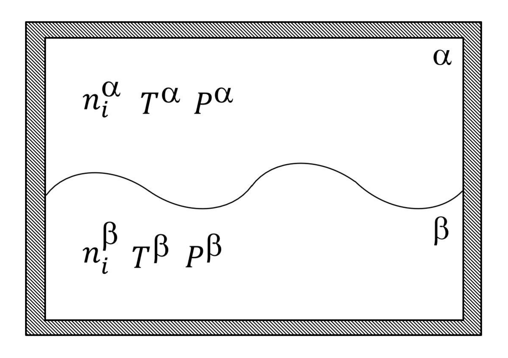
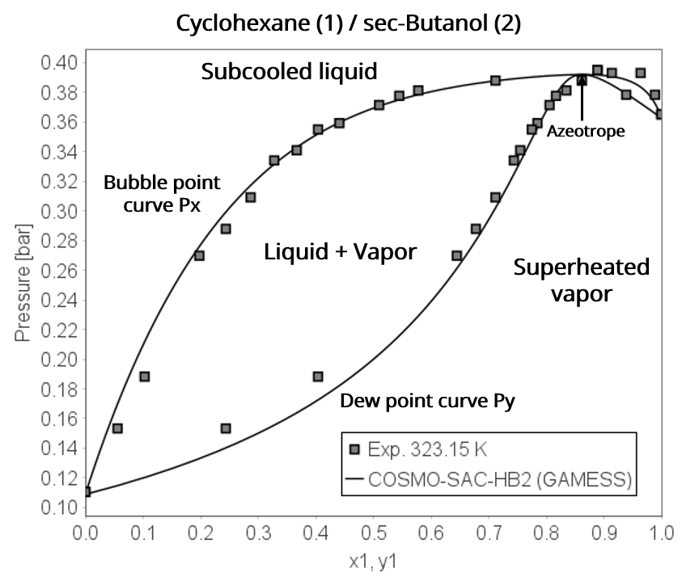
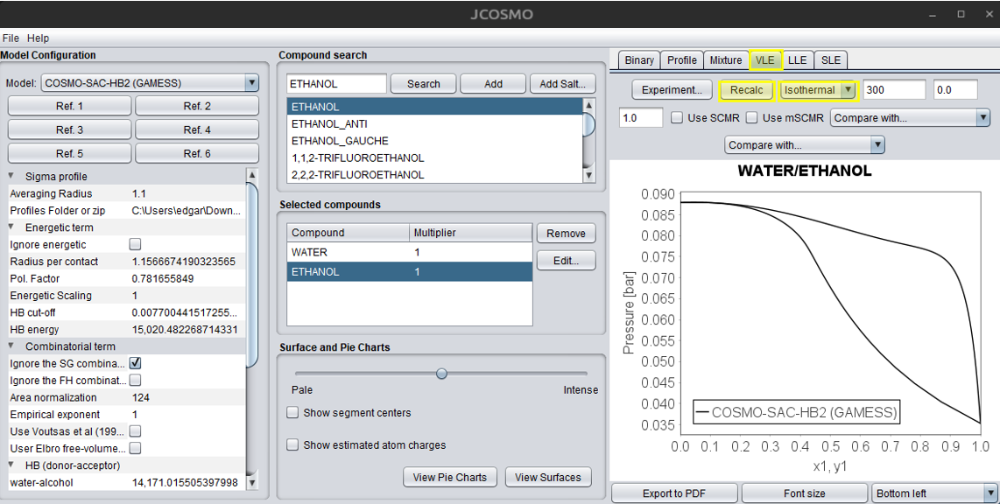
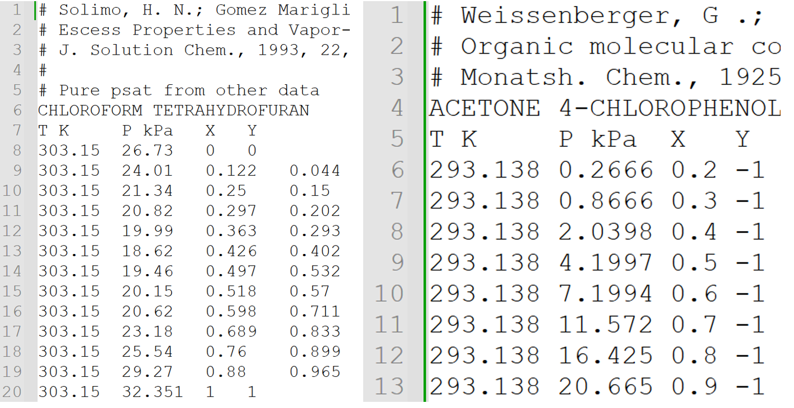

# Vapor-Liquid Equilibrium (VLE)
This section is largely based on the work of Koretsky (2012)[@Koretsky2012] and Smith et al. (2007)[@Smith2007], which constitute the main theoretical basis for the VLE description presented here. Additional references are cited when relevant to specific aspects or extensions of their approach.
## Theory concepts
The separation of a mixture into a liquid phase and a vapor phase is of great importance and utility for the chemical, petrochemical, natural gas, and other industries. The separation process is founded in the phase equilibrium, which describes the conditions under which different phases of a pure substance or a mixture can coexist in thermodynamic equilibrium.

An equilibrium system is often represented for two phases, as shown in the figure below. This system is divided into phases \(\alpha\) and \(\beta\), which for VLE represent a liquid phase and a vapor phase. For the system to be in equilibrium, it is essential that its thermodynamic variables remain constant with respect to both time and position, without the presence of a driving force to induce changes.

<figure style="text-align: center;">
  
  <figcaption>Schematic representation of the equilibrium between two generic phases.</figcaption>
</figure>

There are some criteria for an equilibrium occur. Firstly, if there were a pressure imbalance in the system, it would tend to contract or expand until its pressure equalized with that of its surroundings. Thus, for a system to be in equilibrium, mechanical equilibrium is essential, with no pressure variations:

$$P^{\alpha} = P^{\beta} \tag{1}$$ 

Similarly, for temperature, if the system had a different temperature from its surroundings, a driving force would exist for energy transfer in the form of heat until they become equal. Therefore, for a system to be in equilibrium, thermal equilibrium must exist:

$$T^{\alpha} = T^{\beta} \tag{2}$$ 

However, these two criteria are not sufficient to define thermodynamic equilibrium. Chemical equilibrium must also occur, which is established when there is no tendency for any component of the mixture to change phase or react chemically. The driving force for mass transfer is the difference in the chemical potential \(\mu_i\) of the species between the phases, which translates to the partial molar Gibbs energy of the components present in the system:

$$\mu_{i} = \overline{G}_{i} = \left(\frac{\partial G}{\partial n_{i}}\right)_{T, P, n_{j \neq i}} \tag{3}$$

Thus, for equilibrium to occur, the chemical potential of each component *i* must be equal in all phases:

$$\mu_{i}^{\alpha} = \mu_{i}^{\beta} \tag{4}$$

Thermodynamic equilibrium, therefore, requires all three criteria to be met. For a pure component, the chemical potential is simply the molar Gibbs energy of the substance. The focus here will be on mixtures, as the equilibrium for a pure substance is a special case of the equations that will be described.

---

### Fugacity and Activity Coefficients

Using chemical potential to formulate phase equilibrium presents some mathematical challenges. The first relates to infinite dilution and the second to the scenario where pressure approaches zero, corresponding to the ideal gas limit. In both situations, the chemical potential tends towards negative infinity, creating mathematical inconveniences. To circumvent this problem, a new thermodynamic property is introduced as an alternative to chemical potential, called **fugacity** \(f\):

$$\mu_{i} - \mu_{i}^{\circ} \equiv RT \ln\left(\frac{\hat{f}_{i}}{f_{i}^{\circ}}\right) \tag{5}$$  

where \(\hat{f}_i\) represents the fugacity of component *i* in a mixture, and \(f_i^{\circ}\) is its fugacity at an arbitrary reference state. Substituting Equation 5 into Equation 4, the criterion for chemical equilibrium can be described in terms of fugacity:

$$\hat{f}_{i}^{\alpha} = \hat{f}_{i}^{\beta} \tag{6}$$

A commonly used reference point is an ideal gas mixture. Thus, the definition of fugacity is extended for this condition:

$$\lim_{P\to0} \left(\frac{\hat{f}_{i}}{y_{i}P}\right) \equiv 1 \tag{7}$$

where  \(\hat{f}_{i}^{IG}= y_i P\) and \(y_i\) is the mole fraction of substance *i* in the vapor phase. For an ideal gas, the fugacity is simply the partial pressure. The ratio \(\hat{f}_i / (y_i P)\) is defined as the **fugacity coefficient** (\(\hat{\phi}_i\)) of specie *i* in a mixture:

$$\hat{\phi}_{i} \equiv \frac{\hat{f}_{i}}{\hat{f}_{i}^{IG}} = \frac{\hat{f}_{i}}{y_{i}P} \tag{8}$$

The fugacity coefficient is a dimensionless variable that compares the fugacity of substance *i* to the fugacity of the component in an ideal gas mixture, giving an idea of how far from ideality that species is in the mixture.

When characterizing an incompressible liquid phase, one often resorts to a reference condition other than an ideal gas mixture. In this case, the use of an ideal solution reference is more common. In this context, the fugacity of specie *i* in an ideal solution \((\hat{f}_i^{id})\) is assumed to show a linear relationship with the fugacity of component *i* in its pure state \((f_i)\) and its mole fraction in the liquid \((x_i)\). Thus, the fugacity of component *i* in a mixture, when at the reference state of an ideal liquid, is expressed by:

$$\hat{f}_{i}^{id} = x_{i}f_{i} \tag{9}$$

Analogous to Equation 7, when considering the ideal solution standard state, we can define the **activity coefficient** \((\gamma_i)\) of component *i* in the mixture:

$$\gamma_{i} \equiv \frac{\hat{f}_{i}}{\hat{f}_{i}^{id}} = \frac{\hat{f}_{i}}{x_{i}f_{i}} \tag{10}$$

The activity coefficient serves as an indicator of the non-ideality of species in a liquid, reflecting the interactions present and the effects of molecular structure, in comparison to the ideal solution reference.

The fugacity of the pure component \((f_i)\) can be determined through the following relation:

$$f_i = \phi_i^{sat} P_i^{sat} \exp\left[\frac{v_i^L(P - P_i^{sat})}{RT}\right]\tag{11}$$

where \(P_i^{sat}\) is the saturation pressure of pure component *i*, \(\phi_i^{sat}\) is the fugacity coefficient of the pure component at saturation, \(v_i^L\) is the molar volume of pure component *i* in the liquid phase, and \(R\) is the universal gas constant. The exponential term is called the **Poynting factor** and is usually negligible at pressures below 100 bar. Furthermore, when pressure \(P\) is low, \(\phi_i^{sat} \approx 1\), and the previous equation can be simplified to:

$$f_i \approx P_i^{sat} \tag{12}$$

Therefore, care must be taken to use the activity coefficient only for liquids at low to moderate pressures. The concept of what constitutes a low or moderate pressure is broad and depends on the mixture being analyzed; factors such as strong or weak interactions between compounds and entropic effects related to the molecular structure of the species will impact the pressure up to which the activity coefficient can be used to describe the liquid phase.

---

### VLE Modeling Approaches

The formulation of VLE can be done in different ways, depending on the mixture and system conditions.

#### 1. Modified Raoult's Law (Gamma-Phi)

For low to moderate pressures, the vapor phase can be approximated as an ideal gas. Under these conditions, the activity coefficient can be used for the liquid phase and the fugacity coefficient for the vapor phase is assumed to be 1 (ideal gas). The equation for the equality of fugacities becomes:

$$y_{i}P = x_{i}\gamma_{i}P_{i}^{sat} \tag{13}$$

Equation 13 is called the **modified Raoult's Law** and accounts for non-idealities in the liquid phase. To use Equation 13, models that relate the activity coefficient to the liquid composition \((x_i)\) and temperature \((T)\) are necessary, such as some of the presented in the Theory section of this documentation. Examples are the well-known  NRTL (Non-Random Two-Liquid model)[@Renon1968], the UNIQUAC (Universal Quasichemical) model [@Abrams1975], the UNIFAC model [@Fredenslund1975], and the COSMO-SAC model [@Lin2002].

Another important variable is the saturation pressure \(P_i^{sat}\), which is generally obtained experimentally and then correlated with a model as a function of temperature. Typically, the **Antoine equation** [@antoine1888nouvelle] is used, which is an exponential function with three adjustable parameters:

$$P_i^{sat} = \exp\left(A - \frac{B}{T+C}\right) \tag{14}$$

where \(A\), \(B\), and \(C\) are parameters fitted to experimental data. It is crucial to check the units of pressure and temperature used by the reference source before using parameters from the literature, as the form of the Antoine equation can vary (e.g., using log base 10 instead of a natural exponent). JCOSMO supports several types of saturation pressure correlations, and this is further  discussed in the practical example section.

#### 2. Phi-Phi Method

The second possibility for VLE modeling is to use the fugacity coefficient for both the liquid and vapor phases. This is done for mixtures where pressure plays a significant role, which the activity coefficient approach is unsuitable:

$$y_{i}\hat{\phi}_{i}^{V} = x_{i}\hat{\phi}_{i}^{L} \tag{15}$$

where \(\hat{\phi}_{i}^{V}\) is the fugacity coefficient of the vapor phase and \(\hat{\phi}_{i}^{L}\) is the fugacity coefficient of the liquid phase, both for component *i* in the mixture. The fugacity coefficient is calculated using equations of state (EoS) in conjunction with mixing rules. Some examples are described in the Theory section of this documentation, such as the cubic equations of state and the COSMO-SAC-Phi model. 

---

### Phase Diagrams and Degrees of Freedom

To solve the system of equations formed by either modeling approach, it is necessary to determine the number of degrees of freedom using the **Gibbs Phase Rule**:

$$F = C - P + 2 \tag{16}$$

where \(F\) is the number of degrees of freedom, \(C\) is the number of components, and \(P\) is the number of phases. For a binary system (\(C=2\)) with two phases in equilibrium (\(P=2\)), \(F\) is equal to 2. This means that two variables (e.g., temperature and pressure) must be specified to determine all other properties of the system.

The results obtained from solving the system of equations formed by Equations 13 or 15 are often presented in **Pxy** and **Txy** diagrams of binary systems. The procedure for solving these equations is described in the Algorithm section.

#### Pxy Diagram
In the Pxy diagram shown in the figure below, pressure is plotted against the mole fraction of the liquid and vapor phases (x and y) at a constant temperature. **The Bubble Point Curve (Px curve)** is the upper curve at the diagram. Any point of this curve represents the saturated liquid, where the first bubble of vapor is formed. Above this curve, only the liquid phase exists. **The Dew Point Curve (Py curve)** is the lower curve of the diagram. At any point on this line, the vapor is saturated, where the first drop of liquid is formed. Below this curve, only the vapor phase exists. **The Two-Phase Region** occurs between the two curves, where the liquid and vapor phases coexist in equilibrium.

  
  <figcaption>Pxy diagram of cyclohexane(1)/sec-butanol(2). Squares are experimental data at 323.15 K; black line is the COSMO-SAC model.

#### Txy Diagram
In the Txy diagram shown below, temperature is plotted against composition at a constant pressure. Similarly, **the Bubble Point Curve (Tx curve)** is the lower curve, and for a given liquid composition it shows the temperature at which the first bubble of vapor forms upon heating. Below this curve, only liquid exists. **The Dew Point Curve (Ty curve)** is the upper curve, which represents the temperature where the last drop of liquid vaporizes. Above this curve, only vapor exists. Again, **The Two-Phase Region** occurs between the curves, where liquid and vapor coexist in equilibrium.

  
  <figcaption>Txy diagram of ethanol(1)/water(2). Squares are experimental data at 1.01 bar; black line is the COSMO-SAC model.

#### Azeotropes
In real mixtures, **azeotropes** are frequently observed, which occur when the bubble point and dew point curves touch, as shown in the Pxy diagram. At this point, the composition of the liquid phase is equal to the composition of the vapor phase \((x_i = y_i)\). In the **Pxy** diagram, an **Maximum Pressure Azeotrope (Minimum-Boiling Azeotrope)** can occur when the **Px** and **Py** curves meet at a maximum pressure. This happens when the interactions between unlike molecules are weaker than those between like molecules. Thus, the components prefer to be in their pure state, making the mixture more volatile than the pure components, resulting in a higher vapor pressure and a lower boiling point. Likewise, a **Minimum Pressure Azeotrope (Maximum-Boiling Azeotrope)** can happen when the curves meet at a minimum pressure. This signifies that the interactions between unlike molecules are stronger than those between like molecules. Consequently, the components prefer to be mixed, making the mixture harder to vaporize than the pure components. This results in a lower vapor pressure and a higher boiling point, requiring more energy to vaporize the mixture:

---
## Algorithm

This section is currently under development and will be available soon. Stay tuned for updates!

<!--
As discussed in the Theory concepts section, there are two main modeling approaches for solving VLE. JCOSMO utilizes, for both of them, a bubble point algorithm. If a isothermal VLE is chosen the pressure (P) and vapor composition (yi) must be found. However, if a isobaric VLE is selected the temperature (T) and yi need to be found. 

**Figure 4** details the algorithm structure for a isothermal VLE. Since the equilibrium temperature is known, the saturation pressures of the pure compounds can be calculated using a correlation (the types and how to introduce its coefficients are detailed in the Practical Example section). The liquid phase composition ($x_i$) must assume a value between 0 and 1, the algorithm discretizes this interval in 200 points. With x_i and T the activity coefficients of the species can be calculated using the activity model selected. With the $\gamma_i$ values, the total system pressure ($P$) and the vapor phase mole fractions ($y_i$) were directly obtained.
-->
## Practical Example

The main model should be selected in the dropdown list shown in the figure below. The model's default options are displayed under the references links, with values of the universal parameters and different options of combinatorial terms.

  

JCOSMO currently supports only binary VLE systems. However, the Mixture tab allows users to view activity coefficients for mixtures with n compounds. This data can be extracted via a Python script, and phase equilibria can then be solved externally. This advanced use case is further explained in Python Interface section. 

For a binary system, you can directly search for the two compounds and add them to the system, as illustrated in the figure below. The search engine uses compound names; if the desired compound is not found, try using alternative synonyms. The first selected compound is represented by the subscript **1**, and the second by **2** in all calculated properties.

  

Before starting the VLE calculations, press the "Edit..." button and carefully review the properties of each compound.  If critical properties are missing, they should be added if a cubic equation of state is going to be used. The saturation pressure is required if an activity coefficient model is selected, according to the Modified Raoult's Law in the Theory concepts section. By pressing the "Edit..." button, the user can choose the best available correlation. Coefficients are provided just for the default option; if another type is selected, the user must manually enter the new coefficients. Information about each property and correlation is available at the bottom section of the window. After making the necessary changes, confirm by clicking the "OK" button. The figure below illustrates the process of editing compounds and their properties:

  

The next step is to compute the VLE. First, select the VLE tab in the upper-right corner of the JCOSMO window. The user can select the desired type of diagram, isobaric or isothermal, by clicking in the dropdown menu. The field on the right corresponds to either the temperature or pressure, depending on the selected diagram type, and can be adjusted by the user. The temperature must be provided in Kelvin and the pressure in bar. The next fields are the start and end value of composition. When the cursor is placed over any of these fields, a tooltip will appear indicating the required property and its unit. The "Use SCMR" option enables the user to apply this mixing rule, which combines an activity coefficient model with an equation of state. Currently, only the SRK-MC equation of state is available for this option. For more information, refer to the "Cubic Equations and Mixing Rules" section under the Theory tab. The next dropdown menus are used to select more models to compare with the main model. Ensure that all required properties are included for each model. Finally, press the "Recalc" button to compute the VLE. The figure below illustrates this process in the JCOSMO GUI. If you want to save the chart you can press the "Export to PDF" button, which will save a PDF file in the ...\jcosmo3\pdf directory.  Alternatively, you can right click with the mouse and copy the chart. The "Copy to clipboard" option will save the calculations, which can be pasted in an Excel file. The caption box location can be changed in the dropdown menu at the bottom of the window. For more details about binary charts and all options, see the "Binary Mixture Charts" section under Use cases in this documentation.

  

The comparison of experimental data with the calculated results is also available. This requires creating a .txt file following the template shown in the figure below. The hash symbol (#) is used for comments. Initially write the first and second components, from left to right, with the exact same name as found in the interface. Then, add a header with temperature (T), pressure (P), molar liquid composition (X), and molar vapor composition (Y).  If the letter W is used instead of X, mass fractions are assumed for the liquid phase—this is especially useful for polymers.  Right after the property, include its respective unit. Other temperature units can be used, but never use the degree symbol (°) or it will cause errors. Same for pressure, several units can be used – atm, mmHg, bar, psi, BTU. If data for one of the phases is missing, entering -1 will indicate its absence.

  

After building the .txt file, you can simply load it into the program by clicking the "Experiment..." button on the VLE tab, as shown below:

  

